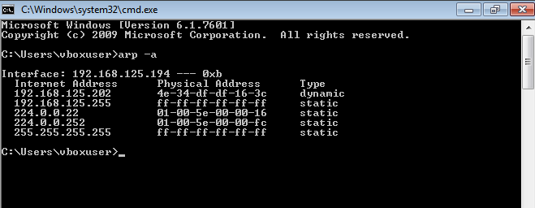
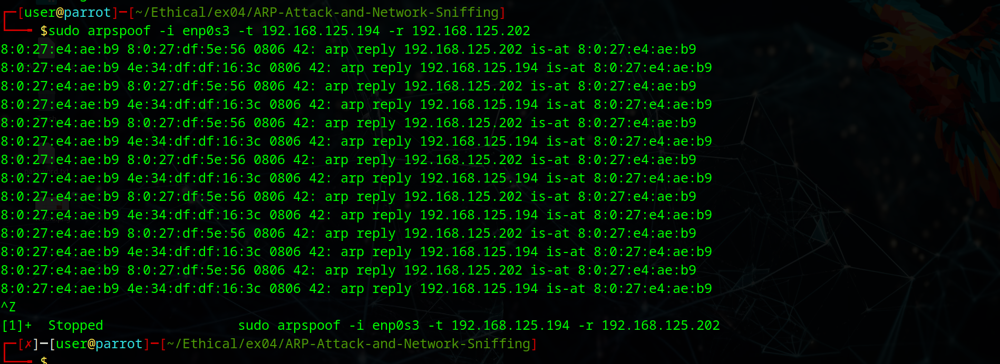
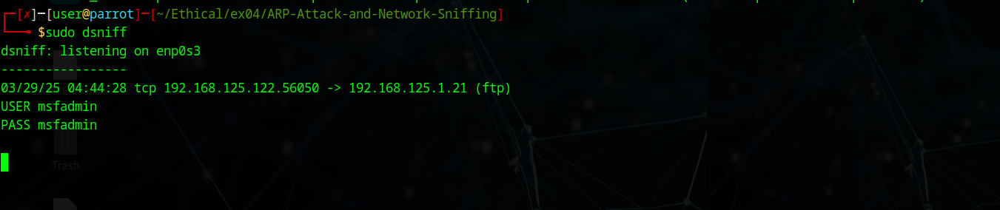

# ARP-Attack-and-Network-Sniffing
# Explore Network Sniffing and ARP Attacks

# AIM:

To explore network sniffing and ARP Attacks

## STEPS:

### Step 1:

Install kali linux either in partition or virtual box or in live mode

### Step 2:

Investigate on the various categories of tools as follows:

### Step 3:
Open terminal and try execute some kali linux commands

## ARP Attacks:  
ARP spoofing: A hacker sends fake ARP packets that link an attacker's MAC address with an IP of a computer already on the LAN. 
Boot kali and Windows7 virtual machines.
In windows 7 give the command arp -a
## OUTPUT:

From kali linux issue the command :
sudo arpspoof -i eth0 -t <target system> <gateway>
## OUTPUT:

 dsniff:

In Metasploit open the ftp console as below. Also you can try other ftp websites ftp.vim.org
## OUTPUT:

In Kali issue the following commands:
sudo dsnifff
## OUTPUT:

Invoke the wireshark and examine the various menus  and controls of the tool:

## OUTPUT :

## Ettercap

Ettercap supports active and passive dissection of many protocols (even encrypted ones) and includes many feature for network and host analysis.
Ettercap can be used as sniffing tool as illustrated below:

## OUTPUT :

## RESULT:
The kali linux tools for ARP Attack and Network Sniffing were identified successfully
